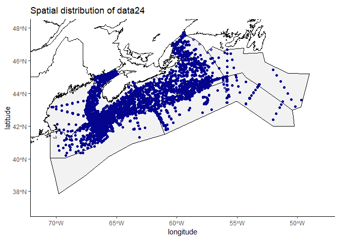
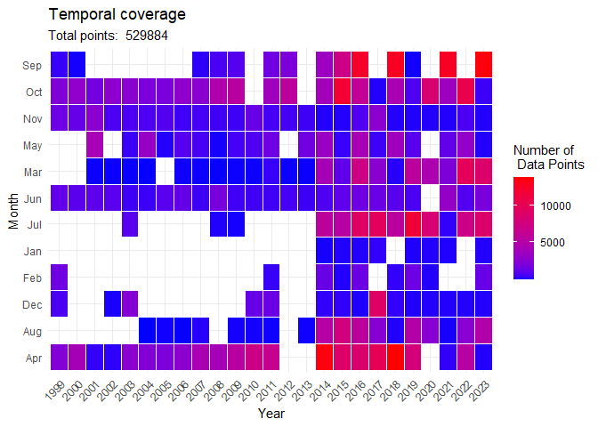

<!-- README.md is generated from README.Rmd. Please edit that file -->

# AZMP_climatology

<!-- badges: start -->
<!-- badges: end -->

The goal of AZMP_climatology is to generate a monthly climatology
product for the Scotian Shelf. This product will be used to update the
QC methodology used at Bedford Institute of Oceanography to quality
control bottle data from our long term monitoring programs.

The current QC system compares bottle data to a monthly climatology
which was generated in 2014 by Gordana Lazin, Andrew Cogswell, Catherine
Johnson, Shelley Bond and Jeff Jackson (unpublished). This climatology
makes some small improvements in data quality and parameter coverage. It
also updates the dataset to a more relevant time period.

# 2014 comparison

There were multiple changes implemented in this updated version of the
Scotian Shelf climatology, although most of the methods remained the
same as they were in 2014. The main changes were:

- A reduced temporal range Data was only extracted from 1999-2023, as
  opposed to 1950-2013 in the 2014 version

- Additional quality control As recommended by the original authors in
  2014, additional QC procedures were implemented before climatology
  calculations were performed, including stage 2 testing from the IML QC
  protocol (range testing, comparitive measurements, constant profile,
  replicate variation, and others)

- Improved data coverage More parameters are included in this updated
  version. Phaeo, Ammonia, Nitrite, oxygen, were added to the list of
  parameters included in the climatology.

# Data summary

The data used in this project was extracted from BioChem, DFO’s national
database. Data for relevant parameters was extracted for the Scotian
Shelf region. The data was then put through a series of quality control
steps to verify quality and remove outliers and questionable data. Data
was then summarized in 9 geographic boxes, over 4 depth intervals, for
each month.

<!-- -->

Figure 1. Spatial distribution of all data included in the climatology.
Scotian Shelf climatology boxes are shown in grey.

<!-- -->

Figure 2. Temporal distribution of climatology data. Each tile
represents the number of data points collected in a given month.

## Reports and scripts available

## Products available

## Update Log
